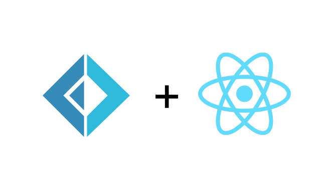

<a name="readme-top"></a>

<!-- PROJECT SHIELDS -->

[![Contributors][contributors-shield]][contributors-url]
[![Forks][forks-shield]][forks-url]
[![Stargazers][stars-shield]][stars-url]
[![Issues][issues-shield]][issues-url]
[![MIT License][license-shield]][license-url]

<!-- PROJECT LOGO -->
<br />
<div align="center">
  <a href="/">
    
  </a>

  <h3 align="center">Starker Regen</h3>

  <p align="center">
    An experimental and minimal React template with F#.
    <br />
    <a href="https://github.com/data-miner00/starker-regen"><strong>Explore the docs »</strong></a>
    <br />
    <br />
    <a href="https://github.com/data-miner00/starker-regen">View Demo</a>
    ·
    <a href="https://github.com/data-miner00/starker-regen/issues">Report Bug</a>
    ·
    <a href="https://github.com/data-miner00/starker-regen/issues">Request Feature</a>
  </p>
</div>

<!-- TABLE OF CONTENTS -->
<details>
  <summary>Table of Contents</summary>
  <ol>
    <li>
      <a href="#about-the-project">About The Project</a>
      <ul>
        <li><a href="#built-with">Built With</a></li>
        <li><a href="#design">Design</a></li>
      </ul>
    </li>
    <li>
      <a href="#getting-started">Getting Started</a>
      <ul>
        <li><a href="#prerequisites">Prerequisites</a></li>
        <li><a href="#installation">Installation</a></li>
      </ul>
    </li>
    <li><a href="#usage">Usage</a></li>
    <li><a href="#roadmap">Roadmap</a></li>
    <li><a href="#contributing">Contributing</a></li>
    <li><a href="#license">License</a></li>
    <li><a href="#acknowledgments">Acknowledgments</a></li>
  </ol>
</details>

<!-- ABOUT THE PROJECT -->

## About The Project


An extremely opinionated template for building React applications with F#. This template allows users to focus on the application itself rather than all these low-level configuration stuff.

Incentives:

- Wanted to try out F#, Fable and Feliz
- Buitl this React template so I can use it for other projects.

Of course, no one template will serve all projects since your needs may be different. So I'll be adding more in the near future. You may also suggest changes by forking this repo and creating a pull request or opening an issue. Thanks to all the people who have contributed to expanding this template!

<p align="right">(<a href="#readme-top">back to top</a>)</p>

### Built With

The technologies and tools used within this template.

- React
- Esbuild
- F#
- JavaScript
- Fable
- Feliz
- TailwindCSS

<p align="right">(<a href="#readme-top">back to top</a>)</p>

<!-- DESIGN -->

### Design

The template uses **Feliz** and **Fable** to transpile the F# source files into plain JavaScript files that are later bundled with **esbuild** into the `public/dist` folder. **Tailwind CSS** will scan for classes used in the F# source file with its JIT compilation feature.

<p align="right">(<a href="#readme-top">back to top</a>)</p>

<!-- GETTING STARTED -->

## Getting Started

### Prerequisites

The list of tools that are used when development.

- npm
  ```sh
  npm install npm@latest -g
  ```
- Pnpm
  ```sh
  npm i -g pnpm
  ```
- [.NET CLI](https://dotnet.microsoft.com/en-us/download)
- [Git](https://git-scm.com/downloads)

### Installation

_To use this template for personal use or contribution, simply perform the following._ A total of **2 terminals** are required to get 3 of the core components of application up and running for development. However, it is possible to start all the necessary processes with one terminal by using `pnpm dev` as shown on step 4.

1. Clone the repo
   ```sh
   git clone https://github.com/data-miner00/starker-regen.git
   ```
2. Install Node dependencies
   ```sh
   pnpm i
   ```
3. Optionally update the dependencies
   ```sh
   pnpm up --latest
   ```
4. Start Fable, Esbuild, Tailwind JIT and local dev server concurrently. Skip 5, 6
   ```sh
   pnpm dev
   ```
5. Start Fable Compiler and Esbuild (requires 1 terminal)
   ```sh
   pnpm watch:fb
   ```
6. Start Tailwind JIT (requires 1 terminal)
   ```sh
   pnpm watch:tw
   ```
7. Compile for production
   ```sh
   pnpm build
   ```
8. Purge dist folder
   ```sh
   pnpm purge
   ```

<p align="right">(<a href="#readme-top">back to top</a>)</p>

<!-- ROADMAP -->

## Roadmap

- [ ] Elmish Routing
- [ ] Data-driven template
- [ ] Interop showcase
- [ ] Fetching data
- [ ] 404 Page

See the [open issues](https://github.com/data-miner00/starker-regen/issues) for a full list of proposed features (and known issues).

<p align="right">(<a href="#readme-top">back to top</a>)</p>

<!-- CONTRIBUTING -->

## Contributing

Contributions are what makes the open-source community such an amazing place to learn, inspire, and create. Any contributions you make are **greatly appreciated**.

If you have a suggestion that would make this better, please fork the repo and create a pull request. You can also simply open an issue with the tag "enhancement".
Don't forget to give the project a star! Thanks again!

1. Fork the Project
2. Create your Feature Branch (`git checkout -b feature/AmazingFeature`)
3. Commit your Changes (`git commit -m 'Add some AmazingFeature'`)
4. Push to the Branch (`git push origin feature/AmazingFeature`)
5. Open a Pull Request

<p align="right">(<a href="#readme-top">back to top</a>)</p>

<!-- LICENSE -->

## License

Distributed under the MIT License. See `LICENSE` for more information.

<p align="right">(<a href="#readme-top">back to top</a>)</p>

<!-- ACKNOWLEDGMENTS -->

## Acknowledgments

List of resources that are helpful and would like to give credit to.

- [Feliz](https://zaid-ajaj.github.io/Feliz/#/)
- [Elmish Navigation with Feliz.Router](https://www.compositional-it.com/news-blog/elmish-navigation-with-feliz-router/)
- [The Elmish Book](https://zaid-ajaj.github.io/the-elmish-book/#/)

<p align="right">(<a href="#readme-top">back to top</a>)</p>

<!-- MARKDOWN LINKS & IMAGES -->

[contributors-shield]: https://img.shields.io/github/contributors/data-miner00/starker-regen.svg?style=for-the-badge
[contributors-url]: https://github.com/data-miner00/starker-regen/graphs/contributors
[forks-shield]: https://img.shields.io/github/forks/data-miner00/starker-regen.svg?style=for-the-badge
[forks-url]: https://github.com/data-miner00/starker-regen/network/members
[stars-shield]: https://img.shields.io/github/stars/data-miner00/starker-regen.svg?style=for-the-badge
[stars-url]: https://github.com/data-miner00/starker-regen/stargazers
[issues-shield]: https://img.shields.io/github/issues/data-miner00/starker-regen.svg?style=for-the-badge
[issues-url]: https://github.com/data-miner00/starker-regen/issues
[license-shield]: https://img.shields.io/github/license/data-miner00/starker-regen.svg?style=for-the-badge
[license-url]: https://github.com/data-miner00/starker-regen/blob/master/LICENSE.txt
[product-screenshot]: images/screenshot.png
